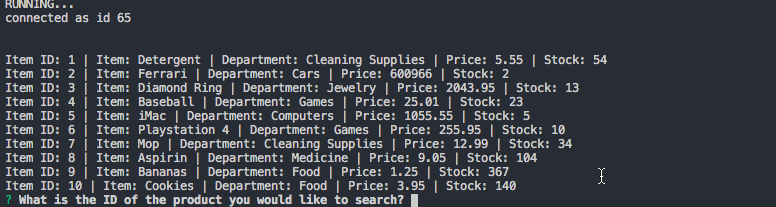

# Bamazon_SQL
### A store display & item ordering app utilizing an SQL database

```diff
+ How it Works +
```
###### Users are presented with a list of available items, and prompted for what they would like to order, by ID
###### Users input an Item ID, and are prompted for the amount of this item they would like to purchase
###### Users are prompted whether they would like to end their order here, or begin the ordering process again 

#### An Example
Users can repeat the process as many times as they like by anwering "Yes" at the last query



#### Invalid Entries
If the user requests more of an item than there are in stock, it will repeat the question until you give a valid answer. Users may exit the app by anwering "No" at the last query


```diff
! A Note !
```
##### If you do not enter your correct MySQL username, port, and password in **bamazon.js**, it will not work -- see the code snippet below:

```js
    var connection = mysql.createConnection({
    host: "localhost",

    // Your port; if not 3306
    port: 3306,

    // Your username
    user: "root",

    // Your password
    password: "",
    database: "bamazon_DB"
});
```

```diff
# Have fun coding! #
```